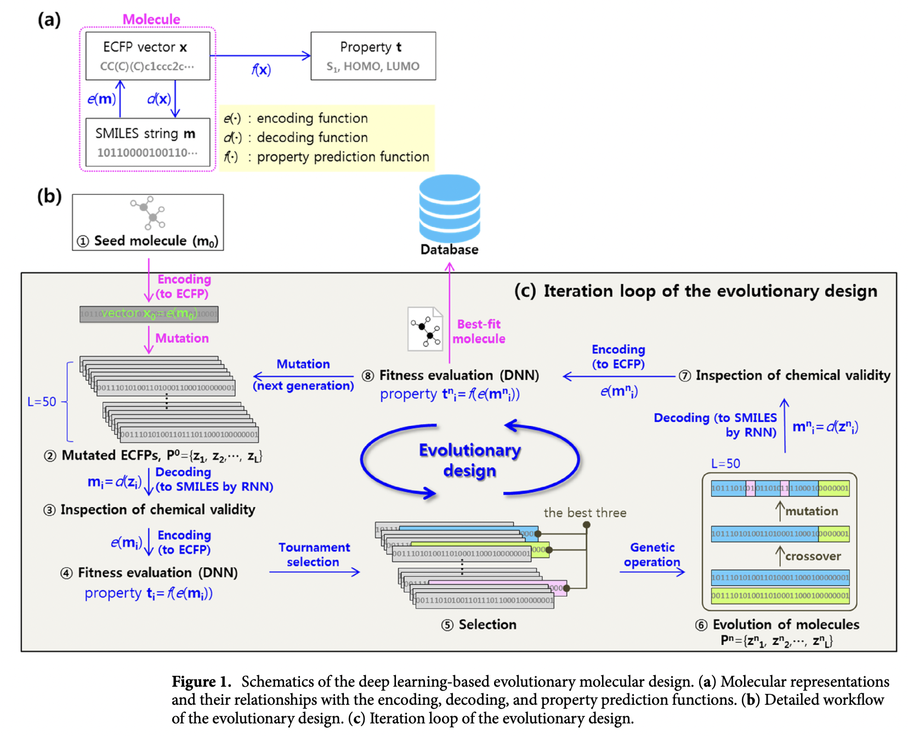

</img>

## Evolutionary Design of Molecules with Deep Learning and Genetic Algorithms (wip)

Unofficial implementation of the paper <a href="https://www.nature.com/articles/s41598-021-96812-8">Evolutionary design of molecules based on deep learning and a genetic algorithm</a>.

There are a few improvements that will be improvised on top of the general idea. (1) Use an equivariant attention network for the autoencoder. (2) Latent space will be using independent binary codes, the <a href="https://arxiv.org/abs/2310.05737">lookup-free quantization</a> proposed by Yu et al. (3) Will bring in a few ideas to maintain greater diversity in the genetic pool

May also include a policy network for choosing the parents, as proposed in the paper <a href="https://openreview.net/forum?id=Qx6UPW0r9Lf">Reinforced Genetic Algorithm for Structure-based Drug Design</a>.

## Citations

```bibtex
@article{Yu2023LanguageMB,
	title 	= {Language Model Beats Diffusion - Tokenizer is Key to Visual Generation},
	author 	= {Lijun Yu and Jos'e Lezama and Nitesh B. Gundavarapu and Luca Versari and Kihyuk Sohn and David C. Minnen and Yong Cheng and Agrim Gupta and Xiuye Gu and Alexander G. Hauptmann and Boqing Gong and Ming-Hsuan Yang and Irfan Essa and David A. Ross and Lu Jiang},
	journal = {ArXiv},
	year 	= {2023},
	volume 	= {abs/2310.05737},
	url 	= {https://api.semanticscholar.org/CorpusID:263830733}
}
```
